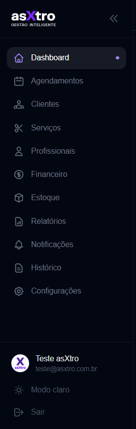
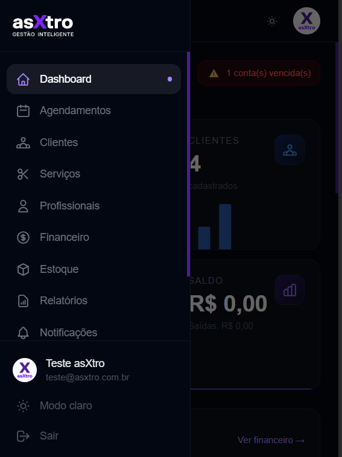
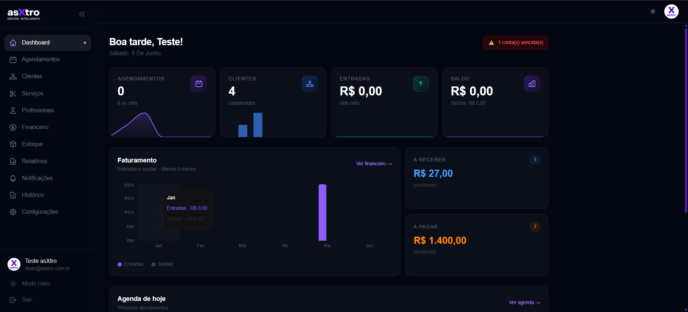
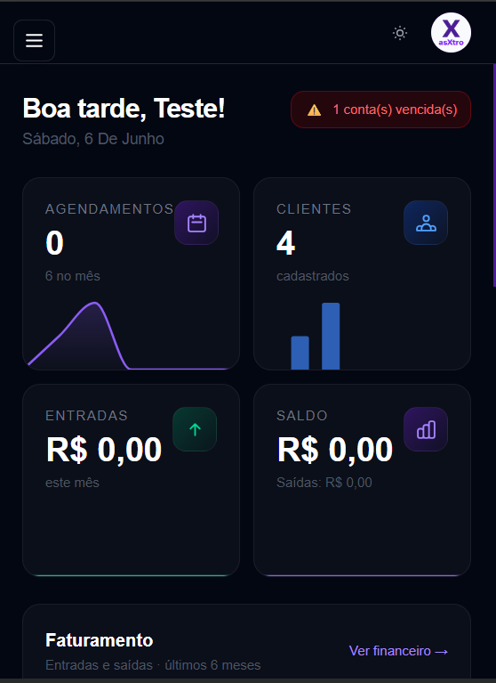

# Dashboard e Navegação

## Acessando o sistema

O asXtro funciona tanto no **navegador do computador** quanto instalado no **celular como aplicativo** (PWA). O conteúdo é o mesmo — o layout se adapta ao tamanho da tela.

> 📱 **Instalar no celular:** acesse `app.asxtro.com.br` pelo navegador do celular, toque no menu do navegador e escolha **"Adicionar à tela inicial"**. O asXtro será instalado como um app, sem precisar de App Store.

---

## Navegação

### No computador — Sidebar

A sidebar é a barra lateral esquerda, presente em todas as telas. É por ela que você acessa todos os módulos.

| Item | O que abre |
|---|---|
| **Dashboard** | Visão geral do negócio |
| **Agendamentos** | Agenda visual e novo agendamento |
| **Clientes** | Cadastro e histórico de clientes |
| **Serviços** | Serviços oferecidos e categorias |
| **Profissionais** | Equipe e vínculos com serviços |
| **Financeiro** | Caixa, A Pagar e A Receber |
| **Estoque** | Produtos, insumos e movimentações |
| **Relatórios** | DRE, Fluxo de Caixa, Comissões e mais |
| **Notificações** | Funil de WhatsApp e Email |
| **Histórico** | Log de todas as ações do sistema |
| **Configurações** | Dados do negócio, horários, aparência |

Na parte inferior da sidebar:

- **Avatar com nome e email** — clique para acessar seu perfil
- **Modo claro** — alterna entre tema escuro e claro
- **Sair** — encerra a sessão

**Recolher a sidebar:** clique nas setas `«` no canto superior direito da sidebar para ganhar mais espaço na tela. Clique novamente para expandir.

---

### No celular — Menu lateral

No celular, a sidebar não fica visível o tempo todo. Para acessar a navegação:

1. Toque no ícone **☰** no canto superior esquerdo da tela
2. O menu desliza da esquerda, sobrepondo o conteúdo
3. Toque em qualquer item para navegar
4. Toque fora do menu para fechá-lo

O conteúdo do menu é o mesmo do desktop — todos os módulos, perfil, modo claro e sair.

> 💡 **Dica:** Os itens visíveis dependem dos módulos ativos no seu plano. Se um módulo não aparece, ele pode estar desativado — entre em contato com o suporte.

---

## Dashboard

O Dashboard é a primeira tela após o login. Mostra um resumo em tempo real do seu negócio.

> 📱 **No celular:**
>
> 

---

### Alerta de contas vencidas

Se houver contas a pagar vencidas, um **alerta vermelho** aparece no canto superior direito com o número de pendências. Clique nele para ir direto ao Financeiro.

---

### Cards de indicadores

Quatro cards mostram os números mais importantes do momento:

**Agendamentos** — quantidade de agendamentos hoje. O número abaixo mostra o total do mês. O gráfico de linha mostra a evolução recente.

**Clientes** — total de clientes cadastrados no sistema. O gráfico de barras mostra os cadastros recentes.

**Entradas** — total de receitas registradas no mês atual.

**Saldo** — saldo atual do caixa. Abaixo aparece o total de saídas do mês.

> 📱 **No celular:** os quatro cards aparecem em grade 2×2. Role para baixo para ver o restante do dashboard.

---

### Gráfico de Faturamento

Exibe entradas e saídas dos **últimos 6 meses**. Use para identificar tendências de crescimento ou queda no faturamento. Clique em **"Ver financeiro →"** para abrir o módulo Financeiro completo.

---

### A Receber e A Pagar

Dois cards mostram os valores pendentes:

- **A Receber** — total a receber com número de cobranças em aberto
- **A Pagar** — total de contas a pagar pendentes

> ⚠️ **Atenção:** O card **A Pagar** em laranja indica contas com vencimento próximo ou em atraso.

---

### Agenda de hoje

Lista os próximos atendimentos do dia com horário, cliente, serviço e profissional. Clique em **"Ver agenda →"** para abrir a tela completa de Agendamentos.
